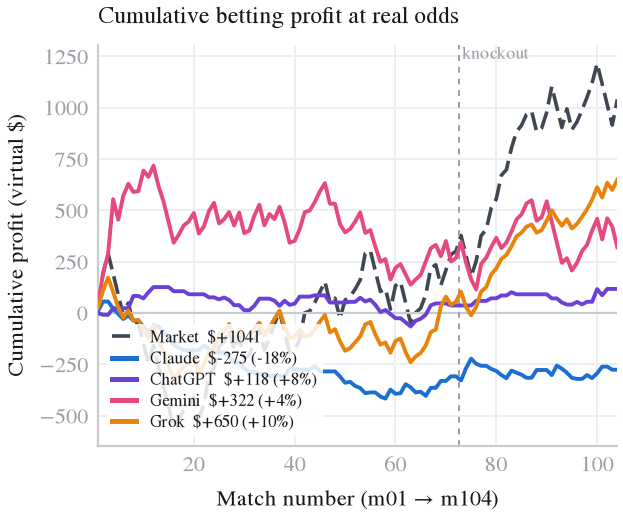
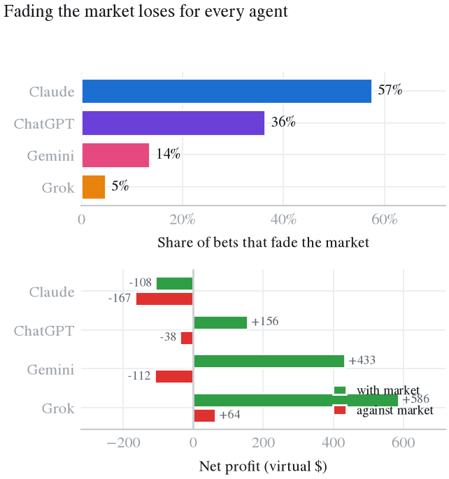
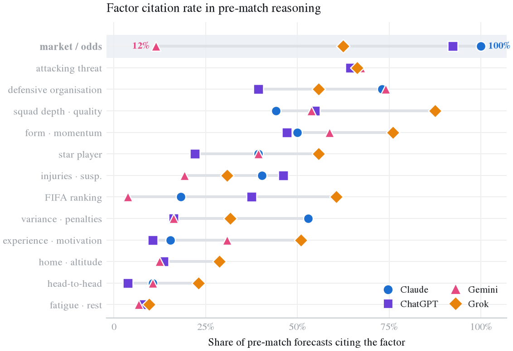
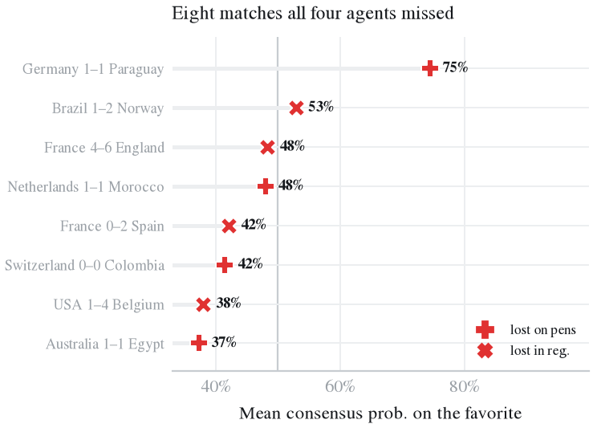

# WC2026-Agents: ChatGPT vs Claude vs Gemini vs Grok vs the betting market on the 2026 FIFA World Cup

[](https://arxiv.org/abs/2607.17765)
[](https://huggingface.co/datasets/dingjiacheng/wc2026-agents)
[](https://graphuofm.github.io/FIFA2026LLM/)
[](https://creativecommons.org/licenses/by/4.0/)
[](LICENSE)

**WC2026-Agents** is an open benchmark and dataset in which four LLM forecasting agents, **Claude Opus 4.8, ChatGPT (GPT-5.5), Gemini 3.1 Pro and Grok (Expert Mode)**, forecast and placed virtual bets on **all 104 matches of the 2026 FIFA World Cup** (11 June to 19 July 2026), scored against the real results and real pre-match betting odds.

**Paper:** [FIFA World Cup 2026 as a Contamination-Free Benchmark for LLM Forecasting Agents: Four Models, a Bookmaker, and 104 Matches](https://arxiv.org/abs/2607.17765) (arXiv:2607.17765), Jiacheng Ding and Cong Guo, University of Memphis.
**Dataset:** [huggingface.co/datasets/dingjiacheng/wc2026-agents](https://huggingface.co/datasets/dingjiacheng/wc2026-agents) · **Project page:** [graphuofm.github.io/FIFA2026LLM](https://graphuofm.github.io/FIFA2026LLM/) · [中文](https://graphuofm.github.io/FIFA2026LLM/zh.html)

## Which AI predicted the 2026 World Cup best?

The four models picked the same outcome in **96 of 104 matches** and reached **65.4% to 68.3% accuracy**. **None beat the betting market's Brier score (0.469).** They differed in what they did with money: at real pre-match odds **Grok made the most virtual profit (+$650, ROI +10.3%)**, Gemini +$322, ChatGPT +$118, and Claude lost $275. Backing the market favourite in every match made +$1,041.

| Forecaster | Accuracy | Brier (lower is better) | Log-loss | Virtual profit | ROI | Bets |
|---|---:|---:|---:|---:|---:|---:|
| Betting market (vig-free odds) | 68.3% | **0.469** | 0.807 | **+$1,041**\* | | 104 |
| Grok (Expert Mode) | 68.3% | 0.4706 | 0.803 | +$650 | +10.3% | 104 |
| Gemini 3.1 Pro | 65.4% | 0.4828 | 0.820 | +$322 | +3.7% | 103 |
| ChatGPT (GPT-5.5, high reasoning) | 68.3% | 0.4729 | 0.814 | +$118 | +8.0% | 55 |
| Claude Opus 4.8 | 66.3% | 0.4705 | 0.806 | -$275 | -18.1% | 73 |

\*Flat stake on the market favourite in every match. Agents set their own stake (up to $100) or skipped. Accuracy is the top-probability pick against the 90-minute result.

## Key findings

1. **The four AIs are near-clones on prediction.** Same pick in 96 of 104 matches (92%); all 8 splits were 3 against 1, with Gemini the lone dissenter in 6. In the 32 knockout matches all four scored exactly 71.9%.
2. **No AI beat the market.** Market Brier 0.469 versus 0.4705 to 0.4828 for the agents. Grok and Claude were marginally below the market on log-loss (0.803, 0.806 vs 0.807), too close to call.
3. **Betting separates them.** Grok bet all 104 matches and won 70 bets (+$650), including +$595 and 24 of 32 wins in the knockout stage. Claude won 24 of 73 bets (-$275).
4. **Betting against the market mostly lost.** Claude bet against the market favourite on 57% of its bets, ChatGPT 36%, Gemini 14%, Grok 5%. Those bets won 21% to 40% of the time (vs 48% to 69% with the market) and lost money for Claude (-$167), Gemini (-$112) and ChatGPT (-$38); Grok's 5 contrarian bets made +$64.
5. **Different evidence, same picks.** Reasoning cites betting odds in 100% of Claude's forecasts, 92% of ChatGPT's, 63% of Grok's and 12% of Gemini's.
6. **Draws are the blind spot.** 24 of 104 matches were 90-minute draws, but no model made a draw its top pick more than 4 times. 22 of the 32 matches all four got wrong were draws.
7. **Knockout upsets fooled everyone.** All four missed Germany 1-1 Paraguay, Netherlands 1-1 Morocco, Australia 1-1 Egypt, Switzerland 0-0 Colombia (penalties), Brazil 1-2 Norway, USA 1-4 Belgium, France 0-2 Spain and France 4-6 England.
8. **Self-reflection is a fingerprint.** On their own wrong picks, Gemini admits "incorrect" 86% of the time, Grok 61%, Claude 49%, ChatGPT 36%.

<p align="center">
  
  
</p>
<p align="center">
  
  
</p>

More answers (did AI predict Spain? why can't AI predict draws?) are in the [FAQ on the project page](https://graphuofm.github.io/FIFA2026LLM/#faq).

## Dataset at a glance

- **104 matches** (m01 to m72 group stage, m73 to m104 knockout), one row per match per model.
- **416 pre-match forecasts** and **414 post-match reflections** (2 Gemini group reflections are missing in the source and flagged, not dropped).
- Per forecast: probabilities (team A win / draw / team B win), bet (pick + stake), free-text reasoning, key sources. Per reflection: outcome self-label, calibration self-judgement, luck, missed and over-weighted factor, counterfactual, would-bet-differently, confidence.
- Ground truth includes **penalty shootouts**: knockout `outcome` is the 90-minute result (a `draw` for the 4 penalty ties, which is how a 1X2 bet settles), with `decided_by`, `pen_a/pen_b` and `advanced` recorded separately.
- **Odds**: pre-match 1X2 lines (mostly DraftKings) with a source URL per match, vig-removed to implied probabilities.

```python
from datasets import load_dataset
forecasts = load_dataset("dingjiacheng/wc2026-agents", "forecasts")
```

See [`data/README.md`](data/README.md) for the schema and known source quirks.

## Repository layout

```
data/
  raw/          original per-model transcripts (read-only)   {model}.txt, {model}_knockout.txt
  metadata/     schedule*.csv, results*.csv, odds*.csv        (fixtures, ground truth, 1X2 odds)
  processed/    {model}.csv (group), {model}_knockout.csv, final-factor probe
  analysis/     tidy 104-match table + every analysis output CSV
src/            parsing + analysis + figure code
paper/          main.tex (ACM sigconf) + references.bib + figures/
docs/           project page (GitHub Pages), llms.txt, figures
geo/            outreach drafts and AI-search tracking
```

## Reproduce

```bash
pip install -r requirements.txt
python src/run_all.py          # rebuild every processed/analysis CSV + all figures
cd paper && latexmk -pdf main.tex   # build the paper (needs a LaTeX install)
```

## How the analysis works

- **Accuracy / Brier / log-loss** against the 3-way 90-minute outcome; **ECE** and reliability curves for calibration; **convergence** = share of matches where all four share a top pick.
- **Betting**: each model's own pick and stake settled at that match's decimal odds; bankroll, ROI, hit rate. A **contrarian** bet backs an outcome other than the market favourite.
- **Market baseline**: vig-removed implied probabilities scored as a fifth forecaster.
- **Content coding**: reasoning and reflection text coded into 13 factor categories with a transparent keyword lexicon (`src/reasoning.py`), no model in the loop.

## Citation

```bibtex
@misc{ding2026wc2026agents,
  title         = {{FIFA} World Cup 2026 as a Contamination-Free Benchmark for
                   {LLM} Forecasting Agents: Four Models, a Bookmaker, and 104 Matches},
  author        = {Ding, Jiacheng and Guo, Cong},
  year          = {2026},
  eprint        = {2607.17765},
  archivePrefix = {arXiv},
  primaryClass  = {cs.LG},
  url           = {https://arxiv.org/abs/2607.17765}
}
```

## License

Code under [MIT](LICENSE). Dataset (`data/`) under [CC BY 4.0](https://creativecommons.org/licenses/by/4.0/); please cite if you use it. All betting is virtual and for research only; this is not gambling advice.
